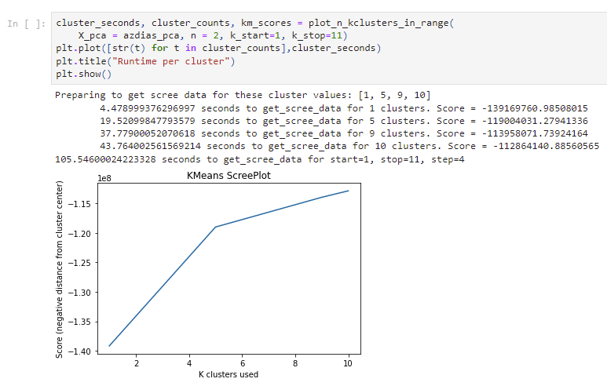
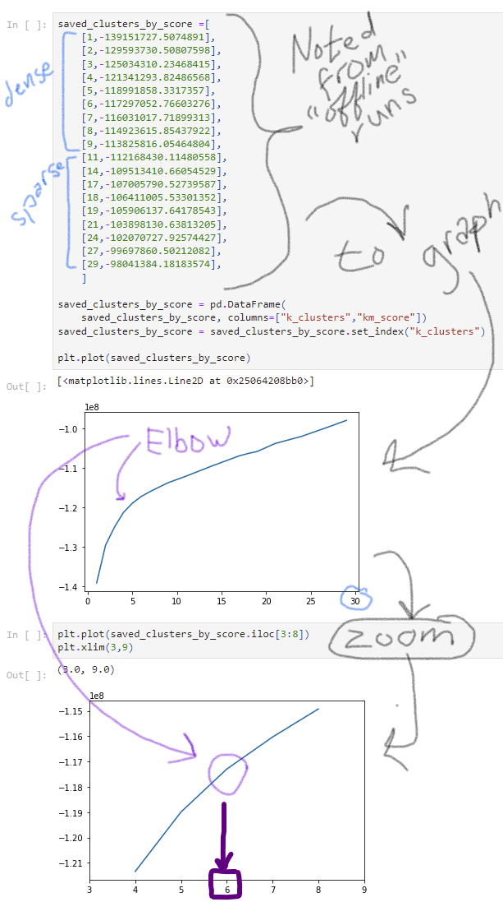

# Tasks for resubmission

## JLS Misc
- [ ] Last task! Copy this list from review1.md into the project before submitting.
- [ ] Annotate the first cell with resubmission notes for reviewer conveniance
- [ ] Remove "TODO" reference from submission (not mentioned by reviewer)

## **Required changes**

---
### Task group: *Evaluating missing rows*
- [ ] You must create a distribution plot to identify the correct threshold to split the subset effectively. (see info in full review)

<details>

### Unmet requirement
> The data has been split into two parts based on how much data is missing from each row. The subsets have been compared to see if they are qualitatively different from one another.

#### Unmet sub-requirement
> The data has been split into two parts based on how much data is missing from each row.

#### Notes
It's not enough to just look at an arbitrary number of values or a ratio. The reviewer gave an example of how to fix.

</details>

---
### Task group *Apply missing rows cleanup to customer data*
- [ ] Kindly address the feedback provided in the following rubric (JLS - related to distribution plot for data splitting.)

<details>
  
### Unmet requirement
> A function applying pre-processing operations has been created, so that the same steps can be applied to the general and customer demographics alike.

#### Unmet sub-requirement
> same steps can be applied to the general and customer demographics alike

#### Notes
Fix the issue in main data, then determine what to do with it in customer data.

</details>

---
### Task group *pick a kmeans cluster size*

- [ ] You should increase the range of K if you struggle to find the elbow.
- [ ] Try at least from K=2. Create one scree plot like this. Using this range, you might come up with an optimal number of centroids.
- If KMeans take a longer time to fit, then you can go for 'minibatchkmeans’ to significantly reduce the fitting time. 
  - JLS - process time was a big issue in my project,
I might consider taking the time to implement minibatches. Considering this optional.) Alternatively,
now that I have an idea of where the elbow is I can decrease my range and run the first 11 or so clusters.

#### ***NOTE FOR REVIEWER***: I'm a little confused on this one.
I wonder if this section was *too* informative and maybe I confused my previous reviewer? See details in
this collapsed section.

<details>
    <summary>Task notes and **Questions about previous feedback**</summary>

## Question

Did I misunderstand kmeans cluster selection? Or was my presentation confusing?

## Requirement notes from last reviewer

### Unmet requirement
> Multiple cluster counts have been tested on the general demographics data, and the average point-centroid distances have been reported. A decision on the number of clusters to use is made and justified.

#### Unmet sub-requirement
> Multiple cluster counts have been tested on the general demographics data

#### Notes
> Due to the short-range defined for the “for” loop, the visualization does not arrive at any turning point/elbow.

## Why I'm confused

I had problems with running through several K means sections so my first section gives an example
of the code I ran and the output, with a very small number of samples. Clearly this isn't enough to make
a judgement on.



Then I ran several more batches in sections, but I preserved the score information and deleted those code cells, so that I wouldn't have 5 or 6 of these to run every time I needed to rerun the full
notebook. I noted the n_cluster/scores as a list, and then plotted those.



I might convert this to minibatches anyway if I can get the time, but I wanted to make 
sure I'm not missing something. Is there something wrong with my graph/process or was this
just confusion about where my data came from?

</details>

---
### Task group *Transform customer data with scalar object*
- [ ] You didn't apply the scaler transformation

<details>
  
### Unmet requirement
> Cleaning, feature transformation, dimensionality reduction, and clustering models are applied properly to the customer demographics data.

#### Unmet sub-requirement
> Data transformation using already fitted Scaler object.

#### Notes


</details>

---
### Task group **
- [ ] Use a bar plot for this task. (JLS - see reviewer example in feedback)
  > You have not performed the comparison of the data proportion in each cluster for the customer data to the proportion of data in each cluster for the general population

- [ ] Describe customer segments
  - [ ] Identify the clusters
  - [ ] Inverse transform the data
  - [ ] Describe the people represented by the inverse transform

<details>
  
### Unmet requirement
> A comparison is made between the general population and customers to identify segments of the population that are central to the sales company's base as well as those that are not.

#### Unmet sub-requirement
- > Compute the proportion of data points in each cluster and visualize, for the general population and the customer data
- > Identified overrepresented and underrepresented clusters.
- > Inferred the kind of people being represented by each cluster type.

#### Notes
- [Suggested article](https://www.geeksforgeeks.org/plotting-multiple-bar-charts-using-matplotlib-in-python/)
for completing this task
- Focus on identifying the segments in the general demographic data where the company can focus on its sales.

</details>

---


# Full notes from reviewer
I've taken a screenshot of the review page with "GoFullPage - Full page screen capture"
- [PDF screen capture](review-archive\submission1\screencapture-review-udacity-2022-07-31-16_05_12.pdf)
- [PNG screen capture](review-archive\submission1\screencapture-review-udacity-2022-07-31-16_05_12.png)

# Overview

## Requires Changes
5 specifications require changes

## Useful References
- [Visualizing statistical plots with Seaborn](https://towardsdatascience.com/visualizing-statistical-plots-with-seaborn-6b6e60ce5e71)
- [Univariate Distribution plot](https://python-data-science.readthedocs.io/en/latest/exploratory.html#distribution-plots)
- [sklearn's RobustScaler](https://scikit-learn.org/stable/modules/generated/sklearn.preprocessing.RobustScaler.html)

# Preprocessing

## NaN values

### Measuring time

- [How to check the execution time of Python script ?](https://www.geeksforgeeks.org/how-to-check-the-execution-time-of-python-script/)

### Code snippet

Speedy loop for replacing missing value codes: 

>"This code takes approximately 1.2 seconds to complete the process of re-encoding the NaN values. It is 1/56 times the total time that students generally come up with."

```python
for attribute, miss_index in zip(feat_info['attribute'], feat_info['missing_or_unknown']):
    missing_values = miss_index.strip('[]').split(',')
    missing_values = [int(value) if (value!='X' and value!='XX' and value!='') else value for value in missing_values]
    if missing_values != ['']:
        azdias[attribute] = azdias[attribute].replace(missing_values, np.nan)
```

## Missing Values
- [5 Ways To Handle Missing Values In Machine Learning Datasets](https://www.geeksforgeeks.org/how-to-check-the-execution-time-of-python-script/)

## Dealing with dimensionality
- [Dealing with features that have high cardinality](https://towardsdatascience.com/dealing-with-features-that-have-high-cardinality-1c9212d7ff1b)

## Feature engineering (manually extracting features from other features/data)
- [Complete Guide to Feature Engineering: Zero to Hero](http://analyticsvidhya.com/blog/2021/09/complete-guide-to-feature-engineering-zero-to-hero/)

# Feature Transformation
- [overfitting](https://machinelearningmastery.com/overfitting-and-underfitting-with-machine-learning-algorithms/)
- [Feature Extraction](https://towardsdatascience.com/feature-extraction-using-principal-component-analysis-a-simplified-visual-demo-e5592ced100a)

## PCA Principle component evaluation
- [Interpretation of the Principal Components](https://online.stat.psu.edu/stat505/lesson/11/11.4)

# Clustering

## Choosing a number of clusters for kmeans

- [mini-batch kmeans](https://scikit-learn.org/stable/modules/generated/sklearn.cluster.MiniBatchKMeans.html)


## Dealing with customer data

- [this post](https://knowledge.udacity.com/questions/65620) 
  for dealing with data from the customer that has other features 
  >`ValueError: operands could not be broadcast together with shapes`


## General populations vs customer distribution

- [this article](https://www.geeksforgeeks.org/plotting-multiple-bar-charts-using-matplotlib-in-python/)
- Consider using assertions to make sure your data shapes line up
    ```python
    assert azdias_clean_data.shape[0] == azdias_manual_clean.shape[0], "clean_data function is not working properly, rows mismatch"
    assert azdias_clean_data.shape[1] == azdias_manual_clean.shape[1], "clean_data function is not working properly, columns mismatch"
    print("If this is all you see, you passed the tests")
    ```

# Get more help from udacity reviewers

- [knowledge hub](https://knowledge.udacity.com/)


